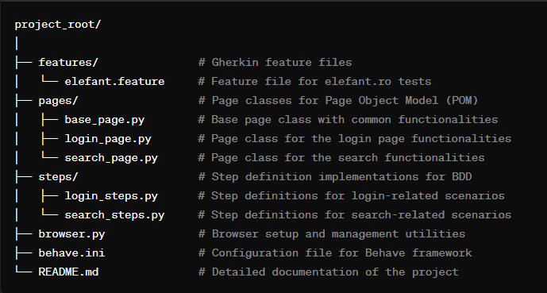

Automated Testing Project for www.elefant.ro
Project Overview
This project is focused on automated testing of the website www.elefant.ro. It includes various scenarios that cover different aspects of the website, ranging from user login to product search and manipulation in the shopping cart.

Features Tested
1. User Login
Valid login with email and password.
Handling wrong email and password inputs.
2. Product Search and Interaction
Searching for products (books, games, etc.).
Navigating through website categories.
Adding and removing products from the shopping cart.
3. UI Elements Verification
Checking the presence of specific elements (e.g., logo, promotional banners).
4. Special Characters Search
Testing the search functionality with special characters.
Tools and Technologies
Selenium WebDriver: For browser automation.
Behave (BDD framework): For writing tests in natural language style.
Python: Programming language used for writing test scripts.
WebDriver Manager: For managing browser driver dependencies.
ChromeDriver: WebDriver for Chrome browser.
Setup and Configuration
Environment Setup:

Ensure Python is installed.
Install necessary Python packages: Selenium, Behave, WebDriver Manager.
Running Tests:

Tests can be executed using the Behave command: behave -f html -o behave-report.html
This will generate an HTML report for the test execution.
Browser Configuration:

Tests are configured to run on Chrome browser.
Browser options (like headless mode) can be adjusted in the browser.py file.
Test Scenarios
The project includes multiple scenarios, each covering different functionalities of the website. Scenarios are defined in Gherkin syntax and are located in the features directory.

Page Object Model
This project follows the Page Object Model (POM) design pattern. It includes:

BasePage class: Contains common methods used across different pages.
LoginPage and SearchPage classes: Contain methods specific to login and search functionalities.
Behave Configuration
The behave.ini file contains configuration for the Behave framework, including the formatter for generating HTML reports.

Code Organization
pages directory: Contains page classes (LoginPage, SearchPage, etc.).
features directory: Contains .feature files with test scenarios.
steps directory: Contains step implementations for the scenarios.
browser.py file: Contains the Browser class for managing the WebDriver instance.
Reporting
Test execution results are generated in an HTML format for easy visualization and analysis.

Project Structure

Conclusion
This project aims to provide comprehensive automated testing for www.elefant.ro, ensuring the reliability and performance of the website's key functionalities.